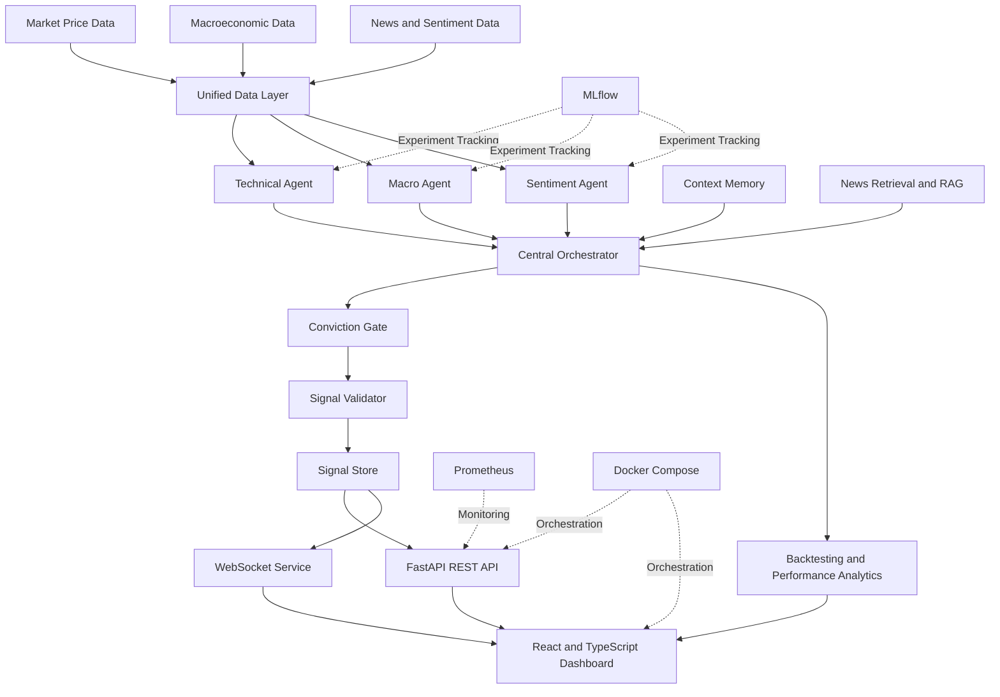
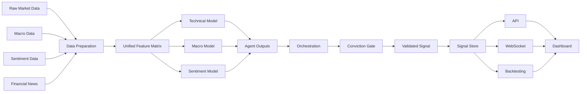
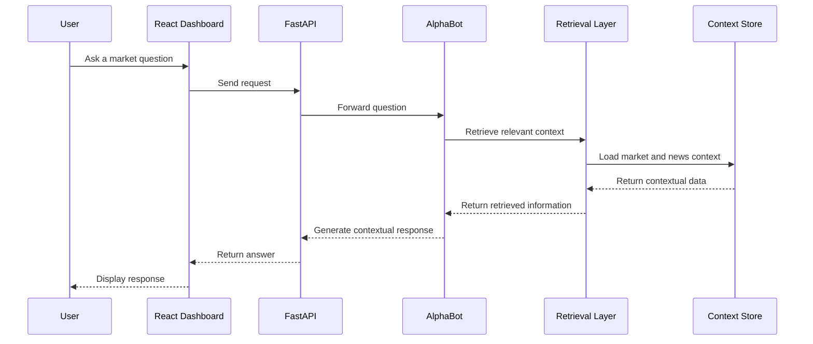

<div align="center">

# FX AlphaLab

## AI-Powered Multi-Agent Forex Intelligence Platform

**Real-time market intelligence, explainable AI signals, risk-aware decision support, and interactive performance analytics.**

<br>


<br>

**Academic engineering project developed over five months by a six-member multidisciplinary team in collaboration with VALUE.**

</div>

---

## Table of Contents

- [Overview](#overview)
- [Business Problem](#business-problem)
- [Solution](#solution)
- [Core Capabilities](#core-capabilities)
- [System Architecture](#system-architecture)
- [Multi-Agent Intelligence Layer](#multi-agent-intelligence-layer)
- [Data and AI Pipeline](#data-and-ai-pipeline)
- [AlphaBot and RAG](#alphabot-and-rag)
- [Backend Architecture](#backend-architecture)
- [Frontend Dashboard](#frontend-dashboard)
- [MLOps and Monitoring](#mlops-and-monitoring)
- [Technical Validation](#technical-validation)
- [Performance Results](#performance-results)
- [Technology Stack](#technology-stack)
- [Repository Structure](#repository-structure)
- [Platform Showcase](#platform-showcase)
- [Getting Started](#getting-started)
- [Team](#team)
- [My Role](#my-role)
- [Project Scope](#project-scope)
- [License](#license)
- [Acknowledgements](#acknowledgements)

---

## Overview

**FX AlphaLab** is an AI-powered Forex intelligence platform designed to support financial analysis through a combination of:

- market-price analysis;
- technical indicators;
- macroeconomic signals;
- financial-news sentiment;
- risk evaluation;
- multi-agent decision orchestration;
- Retrieval-Augmented Generation;
- live API services;
- real-time WebSocket updates;
- interactive dashboards;
- backtesting and performance analysis;
- MLOps and monitoring components.

The platform transforms heterogeneous financial data into structured, explainable and continuously updated decision-support signals.

It was developed as a collaborative academic engineering project over five months by a team of six students with complementary responsibilities in solution architecture, project management and data science.

> FX AlphaLab is a decision-support and research platform. It is not intended to provide financial advice or execute autonomous real-money trading.

---

## Business Problem

Forex analysis requires the simultaneous interpretation of several categories of information:

- rapidly changing price movements;
- technical indicators;
- macroeconomic events;
- news and market sentiment;
- volatility and risk;
- historical strategy performance;
- potentially contradictory analytical signals.

Traditional dashboards often present these elements separately, requiring users to manually combine information from multiple tools and sources.

This creates several challenges:

1. **Fragmented information**  
   Price data, macroeconomic data, sentiment and news are usually analysed independently.

2. **High cognitive load**  
   Analysts must compare multiple indicators and resolve contradictory signals manually.

3. **Limited explainability**  
   A final recommendation may be difficult to justify without a traceable analytical workflow.

4. **Slow reaction time**  
   Market conditions can change faster than a manual analysis process.

5. **Operational complexity**  
   Real-time data, model outputs, backend services and dashboards must remain synchronized.

---

## Solution

FX AlphaLab addresses these challenges through a modular multi-agent architecture.

Each specialized agent analyses a different dimension of the market:

```text
Technical Analysis
        +
Macroeconomic Analysis
        +
Sentiment Analysis
        +
Risk Evaluation
        +
Contextual Knowledge Retrieval
        ↓
Central Orchestration
        ↓
Conviction and Validation Layer
        ↓
Explainable Signal
        ↓
REST API / WebSocket
        ↓
Interactive Dashboard
```

Instead of relying on a single model, the system combines specialized analytical components and passes their outputs through a centralized decision and validation workflow.

---

## Core Capabilities

### Multi-Agent Market Intelligence

- Technical-analysis agent
- Macroeconomic-analysis agent
- Sentiment-analysis agent
- Central orchestration layer
- Conviction gate
- Signal correction and monitoring
- Context memory
- Risk-aware signal validation

### Market Data Processing

- Forex market-price ingestion
- Macroeconomic-data ingestion
- Financial-news processing
- Sentiment-data processing
- Unified feature matrix
- Real-time context updates
- Change detection

### Decision Support

- Consolidated market signals
- Confidence and conviction scoring
- Position and risk analysis
- Signal history
- Strategy performance analysis
- Backtesting
- Trade and pair comparison
- Explainable outputs

### User Experience

- Responsive React dashboard
- Live price ticker
- Signal cards
- Detailed market charts
- Performance analytics
- Event calendar
- News feed
- AlphaBot conversational panel
- WebSocket-based updates
- Notification system
- Settings and history pages

### Engineering and Operations

- FastAPI backend
- REST endpoints
- WebSocket services
- Docker images
- Docker Compose orchestration
- MLflow tracking
- Prometheus configuration
- Training containers
- Backend and frontend containers
- Environment-based configuration

---

## System Architecture



---

## Architecture Layers

### 1. Data Layer

The platform uses multiple financial datasets and feeds:

- market-price data;
- macroeconomic data;
- sentiment data;
- financial news;
- unified analytical matrices;
- generated context and signal files.

The repository contains Parquet datasets for market, macroeconomic, sentiment and unified-feature data.

### 2. Intelligence Layer

The intelligence layer contains the specialized agents:

- `technical_agent.py`
- `macro_agent.py`
- `sentiment_agent.py`
- `conviction_gate.py`

These agents are coordinated through:

- `orchestrator.py`
- `runner.py`
- `context_store.py`

### 3. Post-Processing Layer

The post-processing modules validate and refine agent outputs:

- conviction calculation;
- signal correction;
- monitoring;
- validation;
- change detection.

### 4. Service Layer

Backend services expose and coordinate:

- market prices;
- news;
- charts;
- live context;
- economic events;
- backtesting;
- generated signals;
- AlphaBot;
- real-time WebSocket communication.

### 5. Presentation Layer

The frontend provides:

- trading-signal cards;
- live ticker information;
- technical charts;
- performance metrics;
- risk visualizations;
- trade history;
- event calendars;
- news;
- AlphaBot interaction.

### 6. MLOps Layer

The MLOps layer provides:

- dedicated Dockerfiles;
- MLflow experiment tracking;
- Prometheus configuration;
- training environments;
- deployment orchestration.

---

## Multi-Agent Intelligence Layer

### Technical Agent

The Technical Agent analyses price behaviour and technical market structure.

Its responsibilities include:

- processing market-price data;
- identifying technical patterns;
- analysing momentum;
- evaluating trend direction;
- generating pair-specific technical signals;
- contributing a technical-confidence score.

The frontend contains dedicated visualizations for:

- price evolution;
- RSI;
- MACD;
- Bollinger Bands;
- volatility;
- correlation;
- agent confidence.

---

### Macro Agent

The Macro Agent analyses macroeconomic context.

Its responsibilities include:

- consuming macroeconomic datasets;
- evaluating economic indicators;
- processing scheduled events;
- identifying market regimes;
- contributing macroeconomic context to the final decision.

The project includes trained macroeconomic model artifacts and dedicated macro data feeds.

---

### Sentiment Agent

The Sentiment Agent processes financial news and sentiment information.

Its responsibilities include:

- consuming sentiment datasets;
- evaluating market tone;
- analysing financial-news context;
- contributing sentiment orientation and confidence;
- supporting contextual decision-making.

The repository includes a trained sentiment model and a dedicated sentiment dataset.

---

### Central Orchestrator

The orchestrator combines outputs from the specialized agents.

It is responsible for:

- coordinating agent execution;
- collecting individual recommendations;
- resolving signal differences;
- managing analytical context;
- forwarding aggregated outputs to the conviction layer.

The orchestrator is the bridge between independent analytical agents and the unified final decision.

---

### Conviction Gate

The Conviction Gate acts as a final decision-control layer.

Its role is to:

- aggregate agent confidence;
- check analytical consistency;
- apply conviction rules;
- reject weak or contradictory signals;
- generate a more reliable consolidated recommendation.

This prevents the system from treating every analytical output as equally trustworthy.

---

### Context Memory

The context store preserves information required by the analytical workflow.

It supports:

- context persistence;
- cross-agent information sharing;
- recent market-state storage;
- consistent downstream processing.

---

## Data and AI Pipeline



### Main Data Assets

The repository includes:

```text
macro_hourly (3).parquet
market_full (3).parquet
sentiment_dataset.parquet
unified_matrix.parquet
```

The unified matrix contains more than 200,000 rows of integrated market, macroeconomic and sentiment data covering multiple years.

---

## AlphaBot and RAG

The platform contains an **AlphaBot** module supported by retrieval-oriented news processing.

Relevant components include:

```text
Deployment/Backend/app/api/alphabot.py
Deployment/Backend/app/services/agent_service.py
fx_alphalab/fx_alphalab/data_feed/news_rag.py
fx_alphalab/fx_alphalab/data_feed/news_feed.py
fx_alphalab/fx_alphalab/memory/context_store.py
```

AlphaBot is designed to provide a conversational interface for accessing contextual financial intelligence.

Its workflow can be summarized as:



---

## Backend Architecture

The backend is implemented with **FastAPI**.

### API Modules

```text
alphabot.py
backtest.py
calendar.py
charts.py
health.py
news.py
prices.py
signals.py
websocket.py
```

### Service Modules

```text
agent_service.py
backtest_service.py
calendar_service.py
change_detector.py
chart_service.py
demo_service.py
live_context_service.py
news_monitor.py
news_service.py
price_service.py
signal_store.py
signal_validator.py
```

### Backend Responsibilities

- expose market information;
- provide generated signals;
- serve chart data;
- manage live context;
- expose backtesting results;
- return calendar events;
- provide financial-news updates;
- support AlphaBot;
- maintain WebSocket connections;
- validate and store signals;
- monitor changes in the analytical context.

---

## API Domains

| Domain | Purpose |
|---|---|
| Health | Backend availability and service status |
| Prices | Market-price information |
| Signals | Generated and stored trading signals |
| Charts | Data required by technical visualizations |
| News | Financial-news feed |
| Calendar | Macroeconomic-event calendar |
| Backtest | Historical performance and strategy metrics |
| AlphaBot | Contextual conversational intelligence |
| WebSocket | Real-time dashboard updates |

---

## Frontend Dashboard

The frontend is implemented with:

- React;
- TypeScript;
- Vite;
- Tailwind CSS;
- reusable hooks;
- modular components;
- dedicated pages;
- interactive chart components.

### Main Components

```text
AlphaBotPanel.tsx
EventCalendarPanel.tsx
NewsFeedPanel.tsx
NextUpdateCountdown.tsx
SignalCard.tsx
TickerStrip.tsx
```

### Chart Components

```text
AgentConfidenceChart.tsx
BollingerBandsChart.tsx
ChartRenderer.tsx
CorrelationHeatmap.tsx
MACDChart.tsx
PriceChart.tsx
RiskChart.tsx
RSIChart.tsx
VolatilityChart.tsx
```

### Performance Components

```text
DrawdownChart.tsx
EquityCurveChart.tsx
MetricsDashboard.tsx
PairComparison.tsx
PositionSizeCalculator.tsx
RecentTradesList.tsx
```

### Application Pages

```text
HistoryPage.tsx
PerformancePage.tsx
SettingsPage.tsx
```

### React Hooks

```text
useAlphaBot.ts
useNotifications.ts
useSignals.ts
```

---

## Dashboard Capabilities

The application dashboard supports:

- live market-price display;
- pair-specific analysis;
- generated signal visualization;
- agent-confidence display;
- technical-chart exploration;
- risk analysis;
- position-size calculations;
- recent-trade review;
- equity-curve analysis;
- drawdown analysis;
- pair-performance comparison;
- news monitoring;
- macroeconomic-event tracking;
- signal history;
- configurable settings;
- conversational interaction through AlphaBot.

---

## Backtesting and Performance Analytics

The project contains dedicated scripts and backend services for historical evaluation.

Relevant files include:

```text
fx_alphalab/scripts/backtest.py
fx_alphalab/scripts/compute_backtest_stats.py
Deployment/Backend/app/api/backtest.py
Deployment/Backend/app/services/backtest_service.py
```

The performance dashboard contains components for:

- equity curves;
- drawdown;
- recent trades;
- performance metrics;
- pair comparison;
- position sizing.

The purpose of this layer is to evaluate whether historical signals would have produced consistent and controlled performance under the project’s test conditions.

---

## MLOps and Monitoring

### Docker

The project contains separate Dockerfiles for:

```text
mlops/docker/Dockerfile.backend
mlops/docker/Dockerfile.frontend
mlops/docker/Dockerfile.training
```

This separation supports independent application layers:

- backend API;
- frontend dashboard;
- model-training environment.

### Docker Compose

The root `docker-compose.yml` orchestrates the application stack.

Typical responsibilities include:

- starting backend services;
- starting the frontend;
- connecting application components;
- managing environment configuration;
- supporting repeatable deployment.

### MLflow

The project includes:

```text
mlops/mlflow/mlflow_tracking.py
mlops/mlflow/mlruns/mlflow.db
```

MLflow is used to support:

- experiment tracking;
- metric logging;
- model-run comparison;
- reproducibility;
- training-history management.

### Prometheus

The project contains:

```text
mlops/monitoring/prometheus.yml
```

Prometheus provides the foundation for operational monitoring and metric collection.

---

## Technical Validation

The platform was validated across several dimensions:

### API Validation

The backend was tested for:

- endpoint availability;
- successful responses;
- response consistency;
- signal retrieval;
- health status;
- data-service reliability.

### Real-Time Validation

The real-time architecture was validated for:

- WebSocket stability;
- update synchronization;
- signal refresh;
- dashboard consistency;
- event and news propagation.

### Functional Validation

The system was validated for:

- technical signals;
- macroeconomic context;
- sentiment outputs;
- conviction filtering;
- historical signal access;
- chart rendering;
- performance analytics;
- AlphaBot interaction.

### Integration Validation

The platform was tested across:

```text
Data Layer
    ↓
AI Agents
    ↓
Orchestrator
    ↓
Backend Services
    ↓
REST and WebSocket
    ↓
Frontend Dashboard
```

---

## Performance Results

The project presentation reports the following technical validation results:

| Metric | Result |
|---|---:|
| API success rate | **99.6%** |
| Average API response time | **< 200 ms** |
| WebSocket stability | **99.2%** |
| Real-time synchronization accuracy | **98.7%** |

These results represent project-level technical validation conducted during the academic development and demonstration phase.

They should not be interpreted as financial-performance guarantees.

---

## Technology Stack

### Artificial Intelligence and Data

| Category | Technologies and Concepts |
|---|---|
| AI architecture | Multi-agent system |
| Agents | Technical, macroeconomic, sentiment |
| Decision layer | Conviction gate and orchestrator |
| Retrieval | News retrieval and RAG |
| Data formats | Parquet, CSV, JSON |
| Models | PyTorch and serialized Scikit-learn-compatible artifacts |
| Data processing | Python-based feeds and unified feature matrices |
| Backtesting | Custom Python scripts and backend services |

### Backend

| Category | Technologies |
|---|---|
| Framework | FastAPI |
| Communication | REST API, WebSocket |
| Configuration | Environment variables |
| Services | Modular service architecture |
| Testing | Python test scripts |
| Data access | File-based and service-based data handling |

### Frontend

| Category | Technologies |
|---|---|
| Framework | React |
| Language | TypeScript |
| Build tool | Vite |
| Styling | Tailwind CSS |
| Architecture | Components, pages, hooks and utilities |
| Visualizations | Custom analytical chart components |

### MLOps and DevOps

| Category | Technologies |
|---|---|
| Containers | Docker |
| Orchestration | Docker Compose |
| Experiment tracking | MLflow |
| Monitoring | Prometheus |
| Automation | Makefile |
| Model environments | Dedicated training image |

---

## Repository Structure

```text
fx-alphalabs/
│
├── Deployment/
│   ├── Backend/
│   │   ├── app/
│   │   │   ├── api/
│   │   │   │   ├── alphabot.py
│   │   │   │   ├── backtest.py
│   │   │   │   ├── calendar.py
│   │   │   │   ├── charts.py
│   │   │   │   ├── health.py
│   │   │   │   ├── news.py
│   │   │   │   ├── prices.py
│   │   │   │   ├── signals.py
│   │   │   │   └── websocket.py
│   │   │   │
│   │   │   └── services/
│   │   │       ├── agent_service.py
│   │   │       ├── backtest_service.py
│   │   │       ├── calendar_service.py
│   │   │       ├── change_detector.py
│   │   │       ├── chart_service.py
│   │   │       ├── live_context_service.py
│   │   │       ├── news_service.py
│   │   │       ├── price_service.py
│   │   │       ├── signal_store.py
│   │   │       └── signal_validator.py
│   │   │
│   │   ├── main.py
│   │   ├── requirements.txt
│   │   └── .env.example
│   │
│   └── Frontend/
│       └── my-app/
│           ├── src/
│           │   ├── components/
│           │   │   ├── charts/
│           │   │   └── performance/
│           │   ├── hooks/
│           │   ├── pages/
│           │   ├── config/
│           │   └── utils/
│           │
│           ├── package.json
│           ├── vite.config.ts
│           └── .env.example
│
├── fx_alphalab/
│   ├── fx_alphalab/
│   │   ├── agents/
│   │   │   ├── technical_agent.py
│   │   │   ├── macro_agent.py
│   │   │   ├── sentiment_agent.py
│   │   │   └── conviction_gate.py
│   │   │
│   │   ├── orchestrator/
│   │   │   └── orchestrator.py
│   │   │
│   │   ├── data_feed/
│   │   │   ├── macro_feed.py
│   │   │   ├── news_feed.py
│   │   │   ├── news_rag.py
│   │   │   └── price_feed.py
│   │   │
│   │   ├── memory/
│   │   │   └── context_store.py
│   │   │
│   │   ├── postprocessor/
│   │   │   ├── conviction.py
│   │   │   ├── corrector.py
│   │   │   └── monitor.py
│   │   │
│   │   ├── config/
│   │   ├── core/
│   │   └── data/
│   │
│   ├── outputs/
│   │   ├── models/
│   │   ├── models_v3/
│   │   ├── models_v4/
│   │   └── signals.csv
│   │
│   ├── scripts/
│   │   ├── backtest.py
│   │   ├── compute_backtest_stats.py
│   │   ├── run_agent.py
│   │   └── train_agents.py
│   │
│   ├── requirements.txt
│   ├── pyproject.toml
│   └── setup.py
│
├── mlops/
│   ├── docker/
│   │   ├── Dockerfile.backend
│   │   ├── Dockerfile.frontend
│   │   └── Dockerfile.training
│   │
│   ├── mlflow/
│   │   ├── mlflow_tracking.py
│   │   └── mlruns/
│   │
│   └── monitoring/
│       └── prometheus.yml
│
├── mockup/
│   └── alphalab.html
│
├── docker-compose.yml
├── Makefile
├── LICENSE
└── README.md
```

---
## Platform Showcase

### Global System Architecture

<p align="center">
  
</p>

The platform follows a layered architecture connecting data sources, data engineering, AI analytics, backend services, frontend applications, and deployment infrastructure.

---

### Live Dashboard

<p align="center">
  
</p>

The live dashboard provides a unified view of market signals, confidence scores, market context, news flow, and upcoming economic events.

---

### Detailed Signals

<p align="center">
  
</p>

Each signal includes direction, confidence, conviction, analyst breakdown, contextual news, risk information, and AlphaBot-generated explanations.

---

### Strategy Performance

<p align="center">
  
</p>

The performance view tracks signal quality, confidence, win rate, cumulative pips, drawdown, Sharpe ratio, and pair-level performance metrics.

---

### Signal History

<p align="center">
  
</p>

The signal ledger provides full traceability through timestamps, pair information, direction, confidence, agreement level, market regime, price, and exportable CSV records.
## Getting Started

### Prerequisites

Install:

- Git
- Docker
- Docker Compose
- Python
- Node.js and npm, for local frontend development

### Clone the repository

```bash
git clone https://github.com/sarah-falehh/fx-alphalabs.git
cd fx-alphalabs
```

### Environment Configuration

The repository provides example environment files:

```text
Deployment/Backend/.env.example
Deployment/Frontend/my-app/.env.example
fx_alphalab/.env.example
```

Copy each required example file before launching the corresponding component.

Example:

```bash
cp Deployment/Backend/.env.example Deployment/Backend/.env
cp Deployment/Frontend/my-app/.env.example Deployment/Frontend/my-app/.env
cp fx_alphalab/.env.example fx_alphalab/.env
```

On Windows PowerShell:

```powershell
Copy-Item Deployment\Backend\.env.example Deployment\Backend\.env
Copy-Item Deployment\Frontend\my-app\.env.example Deployment\Frontend\my-app\.env
Copy-Item fx_alphalab\.env.example fx_alphalab\.env
```

Review the generated `.env` files and provide the required configuration values.

---

## Run with Docker

From the repository root:

```bash
docker compose up --build
```

Run in detached mode:

```bash
docker compose up --build -d
```

View running services:

```bash
docker compose ps
```

View logs:

```bash
docker compose logs -f
```

Stop the stack:

```bash
docker compose down
```

---

## Run the Backend Locally

```bash
cd Deployment/Backend
python -m venv .venv
```

Activate the environment on Windows:

```powershell
.venv\Scripts\activate
```

Activate it on Linux or macOS:

```bash
source .venv/bin/activate
```

Install dependencies:

```bash
pip install -r requirements.txt
```

Start the FastAPI backend:

```bash
uvicorn main:app --reload
```

FastAPI documentation is typically available at:

```text
http://localhost:8000/docs
```

---

## Run the Frontend Locally

```bash
cd Deployment/Frontend/my-app
npm install
npm run dev
```

The Vite development server will display the local frontend URL in the terminal.

---

## Run the Core AI Package

```bash
cd fx_alphalab
python -m venv .venv
```

Activate the environment and install dependencies:

```bash
pip install -r requirements.txt
```

Available scripts include:

```text
run_agent.py
train_agents_v3.py
train_v4.py
scripts/run_agent.py
scripts/train_agents.py
scripts/backtest.py
scripts/compute_backtest_stats.py
```

The exact command depends on the operation being executed and the environment configuration.

---

## Team

FX AlphaLab was developed by a multidisciplinary team of six engineering students.

| Team Member | Role |
|---|---|
| **Wala Eddine Ghazouani** | Project Lead |
| **Bahaeddine Amara** | Project Manager |
| **Hassan Zorkot** | Data Scientist |
| **Amen Allah Ben Aissa** | Data Scientist |
| **Sarah Faleh** | Solution Architect |
| **Ali Zouaoui** | Solution Architect |

---

## My Role

### Sarah Faleh — Solution Architect

As one of the two Solution Architects, my contribution focused on the coherence and integration of the complete platform.

My responsibilities included:

- contributing to the global system architecture;
- structuring interactions between data sources, AI agents and backend services;
- supporting integration decisions between the intelligence layer, FastAPI backend and React dashboard;
- contributing to the organization of the real-time data and signal workflow;
- supporting architectural consistency across the project modules;
- participating in technical validation;
- contributing to technical documentation;
- contributing to the final project presentation and demonstration.

This repository represents the work of the complete project team. Individual contributions are presented according to the official team-role distribution.

---

## Project Scope

FX AlphaLab was developed as:

- an academic engineering project;
- a five-month collaborative project;
- a multidisciplinary AI, data and software-engineering platform;
- a project developed in collaboration with VALUE;
- a prototype for financial-market decision support.

The repository contains the collective project implementation and preserves its original collaborative history.

---

## Limitations

- The project is an academic prototype.
- It is not a certified financial product.
- It does not provide financial advice.
- Historical results do not guarantee future performance.
- Market data and external feeds may depend on availability and configuration.
- Some generated model artifacts and datasets may require significant local storage.
- Environment variables must be configured before all services can run.
- The platform should not be connected to real-money trading without extensive security, regulatory and risk validation.

---

## Responsible Use

FX AlphaLab should be used for:

- learning;
- research;
- architecture demonstration;
- model experimentation;
- decision-support prototyping;
- academic evaluation.

It should not be used as the sole basis for financial decisions.

---

## License

This project is licensed under the **MIT License**.

The original copyright and license notice must be preserved in copies or substantial portions of the software.

See [`LICENSE`](LICENSE) for details.

---

## Acknowledgements

This project was developed:

- by the six-member FX AlphaLab engineering team;
- over a five-month academic project period;
- in collaboration with **VALUE**.

Special thanks to every team member for their contribution to the project architecture, implementation, data science, integration, testing, project management and final demonstration.

---

<div align="center">

## FX AlphaLab

**From fragmented market data to structured, explainable and real-time financial intelligence.**

</div>
