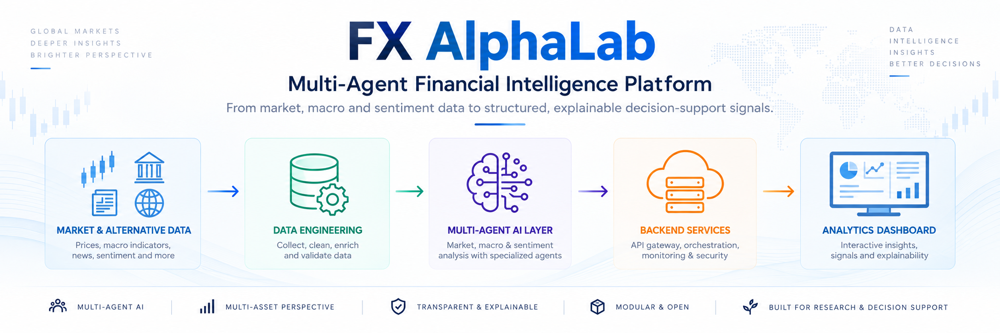
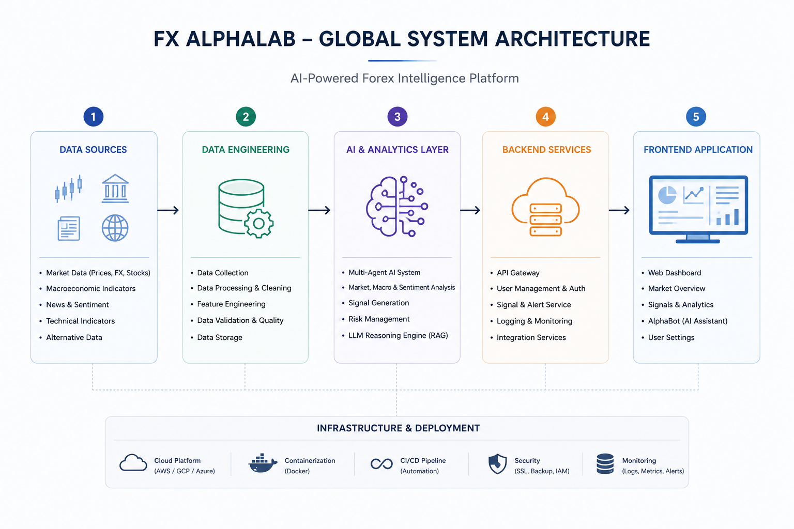
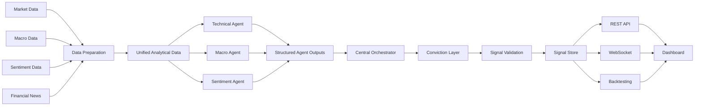
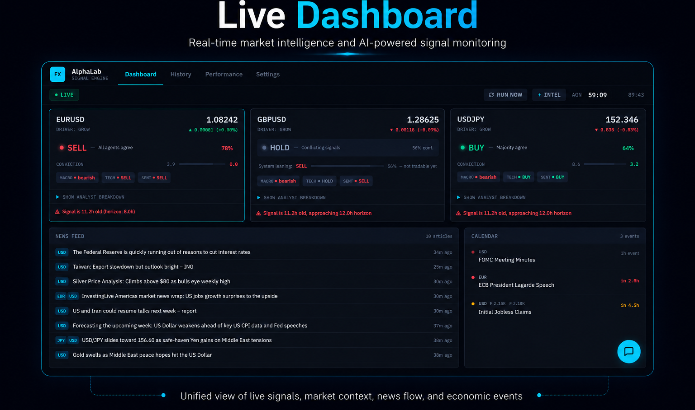
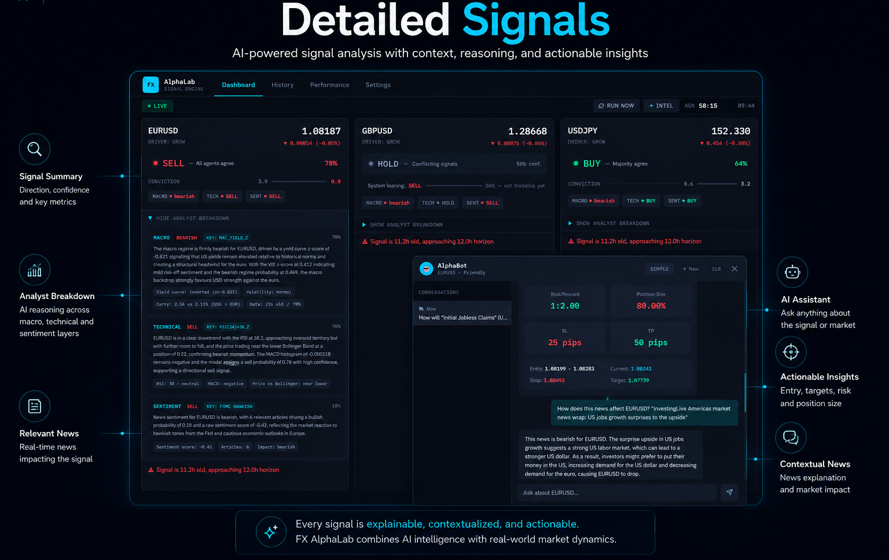
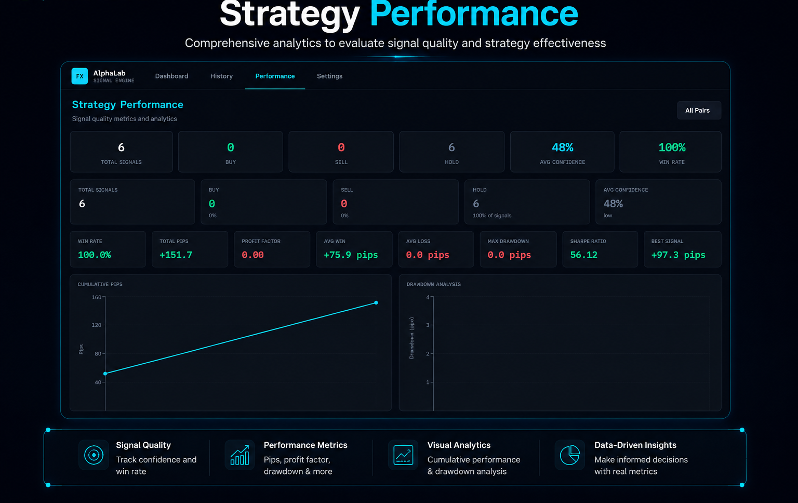
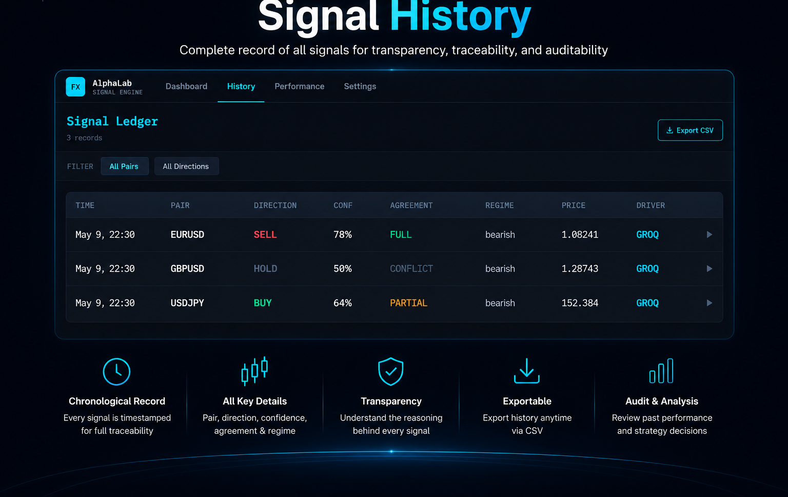

<div align="center">



<br>

# FX AlphaLab

### Multi-Agent Financial Intelligence Platform

**From heterogeneous financial data to modular, contextual and explainable AI-assisted analysis.**


**Five-month engineering project developed by a six-person team in collaboration with VALUE.**

[Overview](#overview) ·
[Architecture](#system-architecture) ·
[Agents](#multi-agent-intelligence-layer) ·
[RAG](#alphabot--contextual-retrieval) ·
[Engineering](#software-engineering) ·
[Showcase](#platform-showcase) ·
[My Role](#my-role--solution-architect) ·
[Limitations](#project-scope-and-limitations)

</div>

---

# Overview

**FX AlphaLab is a financial intelligence and decision-support platform designed to combine heterogeneous market information through specialized analytical components.**

The platform brings together:

- Forex market data;
- technical indicators;
- macroeconomic information;
- financial news;
- market sentiment;
- contextual retrieval;
- specialized analytical agents;
- centralized orchestration;
- historical backtesting;
- FastAPI services;
- REST APIs;
- WebSocket-based dashboard updates;
- interactive financial visualizations;
- ML experiment tracking.

The project was developed over **five months by a team of six engineering students** with complementary responsibilities across architecture, data science, software development and project management.

The objective was not to build an autonomous trading system.

Instead, the engineering problem was:

> **How can heterogeneous financial information be collected, structured and combined through modular AI components while keeping the contribution of each analytical source understandable?**

> [!IMPORTANT]
> FX AlphaLab is an academic financial-intelligence prototype.
>
> It does **not** execute real-money trades, does not constitute financial advice and does not claim validated real-world investment alpha.

---

# Business Problem

Financial analysis rarely depends on a single source.

For a currency pair, several signals may need to be considered simultaneously:

```text
Market prices
      +
Technical indicators
      +
Macroeconomic context
      +
Economic events
      +
Financial news
      +
Market sentiment
      +
Risk conditions
```

These sources can:

- evolve at different frequencies;
- use heterogeneous formats;
- contain contradictory information;
- require different analytical methods.

A single monolithic model would also make it harder to understand where a final signal came from.

FX AlphaLab therefore explores a **modular multi-agent architecture** where specialized components contribute independently to a controlled orchestration workflow.

---

# System Architecture

<p align="center">
  
</p>

The platform is organized into five main layers:

```text
Data Sources
      ↓
Data Engineering
      ↓
AI & Analytics
      ↓
Backend Services
      ↓
Frontend Application
```

The architecture also includes infrastructure components for containerization, experimentation and monitoring.

---

# Data Layer

FX AlphaLab combines several categories of financial data.

## Market Data

Price information used by the technical-analysis components.

## Macroeconomic Data

Economic indicators and scheduled economic information used to provide broader market context.

## News and Sentiment

Financial-news information and sentiment signals used by the sentiment and contextual-analysis components.

## Unified Analytical Dataset

The project integrates heterogeneous sources into a common analytical representation.

The project dataset contains **more than 200,000 rows** of combined market, macroeconomic and sentiment information.

> The 200,000+ rows describe the scale of the project dataset.
>
> They are not presented as evidence of production-scale infrastructure or system scalability.

---

# Multi-Agent Intelligence Layer

FX AlphaLab contains **five intelligent components with different responsibilities**:

### Specialized analytical agents

1. Technical Agent
2. Macro Agent
3. Sentiment Agent

### Coordination component

4. Central Orchestrator

### Contextual assistant

5. AlphaBot / Retrieval Assistant

These components belong to the same broader multi-agent architecture, but they do **not** all have the same degree of autonomy.

---

## Technical Agent

The Technical Agent focuses on price behaviour and technical market structure.

Its inputs and analytical features include:

- price evolution;
- momentum;
- trends;
- RSI;
- MACD;
- Bollinger Bands;
- volatility;
- correlation.

Its output contributes a technical orientation and associated confidence to the broader analysis.

---

## Macro Agent

The Macro Agent focuses on macroeconomic context.

It uses information related to:

- macroeconomic indicators;
- economic events;
- economic conditions;
- market regimes.

Its purpose is to complement short-term market information with a broader economic perspective.

---

## Sentiment Agent

The Sentiment Agent processes financial-news and sentiment information.

Its responsibilities include:

- financial-news context;
- sentiment orientation;
- market tone;
- sentiment confidence.

This creates a third analytical perspective independent of technical and macroeconomic signals.

---

# What Is an Agent in FX AlphaLab?

In the context of this project, the three analytical agents are specialized components that:

```text
receive domain-specific context
        ↓
apply analytical logic / models
        ↓
produce structured outputs
        ↓
return orientation + confidence + context
        ↓
feed the orchestrator
```

The architecture should therefore be understood primarily as a **controlled orchestrated multi-agent workflow**, rather than an ecosystem of unrestricted autonomous agents.

This distinction is deliberate.

For financial decision support, predictable interactions and explicit aggregation were preferred over open-ended agent autonomy.

---

# Central Orchestrator

The orchestrator coordinates outputs generated by the specialized analytical agents.

Conceptually:

```text
Technical Agent ─────┐
                     │
Macro Agent ─────────┼──► Central Orchestrator
                     │
Sentiment Agent ─────┘
```

Its responsibilities include:

- coordinating analytical components;
- collecting their structured outputs;
- maintaining shared context;
- comparing recommendations;
- handling disagreement;
- forwarding the aggregated state to the conviction layer.

The orchestrator is therefore different from the analytical agents.

It coordinates their contributions rather than performing the same type of domain analysis.

---

# Conviction and Validation Layer

Different agents can disagree.

For example:

```text
Technical     → bullish
Macro         → neutral
Sentiment     → bearish
```

Treating such a situation as a high-confidence signal would be undesirable.

FX AlphaLab therefore includes a conviction and validation layer responsible for:

- combining agent confidence;
- examining agreement and disagreement;
- applying decision rules;
- filtering weak signals;
- rejecting inconsistent situations;
- producing a consolidated analytical output.

Conceptually:

```text
Individual agent outputs
          ↓
Central orchestration
          ↓
Conviction evaluation
          ↓
Signal validation
          ↓
Structured signal
```

This keeps individual analysis separate from the final decision-support layer.

---

# Context Store

The architecture also contains a context store.

Its role is to maintain information required across the analytical workflow, such as:

- recent market state;
- analytical context;
- retrieved information;
- recent signals.

Conceptually:

```text
Market Context
Macro Context
Retrieved News
Recent Signals
      ↓
Context Store
      ↓
Agents / Orchestration / Retrieval
```

The goal is to provide shared context without tightly coupling all components together.

---

# AlphaBot & Contextual Retrieval

FX AlphaLab also includes **AlphaBot**, a conversational component connected to financial context.

Relevant repository modules include:

```text
Deployment/Backend/app/api/alphabot.py

Deployment/Backend/app/services/agent_service.py

fx_alphalab/fx_alphalab/data_feed/news_rag.py

fx_alphalab/fx_alphalab/data_feed/news_feed.py

fx_alphalab/fx_alphalab/memory/context_store.py
```

Its high-level workflow is:

```text
User question
      ↓
FastAPI
      ↓
AlphaBot
      ↓
Contextual retrieval
      ↓
Relevant financial/news context
      ↓
Context-grounded response
```

---

# RAG in FX AlphaLab

Retrieval-Augmented Generation and the analytical agents solve different problems.

## Analytical Agents

Produce domain-specific financial analysis.

## Retrieval

Finds contextual information relevant to a query or analytical situation.

## AlphaBot

Provides conversational access to retrieved financial information.

Conceptually:

```text
Question
   ↓
Embedding / Retrieval
   ↓
Relevant context
   ↓
Prompt augmentation
   ↓
Generated response
```

Therefore:

> **RAG supports contextual information access. It is not the mechanism responsible for generating every analytical signal in the platform.**

---

# Data and AI Pipeline



The project therefore covers more than model inference.

It connects:

> **data acquisition → processing → AI analysis → orchestration → validation → API → user interface → historical evaluation**

---

# FastAPI Backend

The backend is implemented using **FastAPI**.

API modules include:

```text
alphabot.py
backtest.py
calendar.py
charts.py
health.py
news.py
prices.py
signals.py
websocket.py
```

Associated services include:

```text
agent_service.py
backtest_service.py
calendar_service.py
change_detector.py
chart_service.py
live_context_service.py
news_service.py
price_service.py
signal_store.py
signal_validator.py
```

This separates:

```text
API / transport layer
          ≠
application / domain logic
```

and reduces coupling between the HTTP interface and analytical services.

---

# REST vs WebSocket

The project uses both REST APIs and WebSocket communication.

They solve different problems.

## REST

Used for request/response operations such as:

- retrieving signals;
- retrieving historical data;
- accessing chart data;
- requesting backtesting information;
- accessing news;
- accessing calendar information.

## WebSocket

Used where the dashboard needs to receive updated information without repeatedly opening a new HTTP request.

Conceptually:

```text
Client asks for information
        → REST

Server pushes updated state
        → WebSocket
```

The presence of WebSocket communication does **not** imply that the entire AI pipeline operates as a low-latency real-time trading platform.

---

# Backtesting

Historical evaluation is implemented through modules including:

```text
fx_alphalab/scripts/backtest.py

fx_alphalab/scripts/compute_backtest_stats.py

Deployment/Backend/app/api/backtest.py

Deployment/Backend/app/services/backtest_service.py
```

Backtesting was used to examine the historical behaviour of generated signals under project assumptions.

Examples of analytical metrics include:

- historical signal performance;
- cumulative results;
- win rate;
- drawdown;
- Sharpe-related indicators;
- pair-level comparisons.

> Backtesting evaluates historical behaviour under defined assumptions.
>
> It does not demonstrate future profitability and FX AlphaLab does not claim validated real-world alpha.

---

# Software Engineering

FX AlphaLab was designed as an end-to-end engineering project.

## Python

Used for data, AI components, orchestration, backend logic and historical evaluation.

## FastAPI

Used as the backend application and API layer.

## React + TypeScript

Used for the interactive frontend.

## REST APIs

Used for standard request/response communication.

## WebSocket

Used for updated dashboard information.

## Docker

Used to containerize application components.

## Docker Compose

Used to coordinate local services.

## MLflow

Used for experiment and run tracking.

## Prometheus

Included as an operational monitoring component.

---

# MLflow

The repository contains an MLflow tracking component:

```text
mlops/mlflow/mlflow_tracking.py
```

Its purpose is to support:

- experiment tracking;
- metric logging;
- comparison between runs;
- reproducibility of experimentation.

MLflow is used for the **ML experimentation lifecycle**, not as evidence of financial performance.

---

# Docker

The project contains separate environments for:

```text
Dockerfile.backend
Dockerfile.frontend
Dockerfile.training
```

This supports reproducible execution for:

- backend services;
- frontend services;
- model-training environments.

The root:

```text
docker-compose.yml
```

coordinates multiple project services.

> Containerization improves reproducibility and portability.
>
> It is not by itself evidence that the application is horizontally scalable or production-ready.

---

# Monitoring

Prometheus configuration is available under:

```text
mlops/monitoring/prometheus.yml
```

It provides a basis for operational metrics.

The project is therefore described as containing **monitoring components**, rather than claiming production-grade observability.

A production deployment would still require stronger capabilities around:

- alerting;
- service-level objectives;
- distributed tracing;
- infrastructure monitoring;
- incident management;
- load testing.

---

# Platform Showcase

## Conceptual Product Overview

<p align="center">
  
</p>

> The visual above is a conceptual overview created to illustrate the main product areas.  
> The screenshots below show the actual project interface.

---

## Dashboard

<p align="center">
  
</p>

The dashboard consolidates market information, analytical signals, confidence information, news and economic context.

---

## Signal Analysis

<p align="center">
  
</p>

Signals are shown with their associated analytical context rather than as isolated predictions.

---

## Historical Performance Analysis

<p align="center">
  
</p>

The historical-analysis interface provides backtesting and analytical performance information.

These results belong to project simulations and are not live investment results.

---

## Signal History

<p align="center">
  
</p>

The signal ledger keeps previous analytical outputs available for inspection and comparison.

---

# Evaluation

FX AlphaLab distinguishes several forms of evaluation.

## Analytical Evaluation

Individual models and analytical components can be evaluated according to their specific tasks.

## Integration Validation

The full workflow verifies communication through:

```text
Data
 ↓
Agents
 ↓
Orchestrator
 ↓
Conviction / Validation
 ↓
Backend
 ↓
Dashboard
```

## Historical Backtesting

Backtesting evaluates generated signals using historical information and project assumptions.

## Application Validation

Backend endpoints, frontend communication and WebSocket integration were exercised during project development.

These dimensions should remain separate.

> **Predictive quality, software reliability and financial performance are three different evaluation questions.**

---

# What This Project Does Not Demonstrate

FX AlphaLab does **not** demonstrate:

- live real-money trading;
- guaranteed profitable signals;
- validated investment alpha;
- high-frequency trading;
- production-scale financial-market infrastructure;
- regulatory readiness;
- institutional execution capabilities.

The main engineering contribution is the integration of heterogeneous financial information into a modular AI decision-support architecture.

---

# Technology Stack

| Layer | Technologies / Concepts |
| --- | --- |
| Programming | Python |
| Data processing | Parquet, CSV, JSON |
| AI architecture | Specialized agents + centralized orchestration |
| Analytical agents | Technical, Macro, Sentiment |
| Retrieval | RAG, embeddings, contextual retrieval |
| Backend | FastAPI |
| Communication | REST API, WebSocket |
| Frontend | React, TypeScript, Vite, Tailwind CSS |
| Experiment tracking | MLflow |
| Containers | Docker, Docker Compose |
| Monitoring | Prometheus |
| Historical evaluation | Python backtesting components |

---

# Repository Structure

```text
fx-alphalabs/
│
├── Deployment/
│   ├── Backend/
│   │   ├── app/
│   │   │   ├── api/
│   │   │   └── services/
│   │   └── main.py
│   │
│   └── Frontend/
│       └── my-app/
│           └── src/
│               ├── components/
│               ├── hooks/
│               ├── pages/
│               └── utils/
│
├── fx_alphalab/
│   ├── fx_alphalab/
│   │   ├── agents/
│   │   │   ├── technical_agent.py
│   │   │   ├── macro_agent.py
│   │   │   ├── sentiment_agent.py
│   │   │   └── conviction_gate.py
│   │   │
│   │   ├── orchestrator/
│   │   ├── data_feed/
│   │   ├── memory/
│   │   ├── postprocessor/
│   │   ├── config/
│   │   └── core/
│   │
│   ├── scripts/
│   └── outputs/
│
├── mlops/
│   ├── docker/
│   ├── mlflow/
│   └── monitoring/
│
├── docs/
│   └── assets/
│       └── readme/
│
├── docker-compose.yml
├── Makefile
├── LICENSE
└── README.md
```

---

# My Role — Solution Architect

## Sarah Faleh — Solution Architect

FX AlphaLab was developed by a six-person team and included **two Solution Architects**.

My contribution focused on architectural coherence and integration across the platform.

My responsibilities included:

- contributing to the global system architecture;
- structuring interactions between data sources, AI components and backend services;
- contributing to the flow between analytical agents and central orchestration;
- supporting integration between the AI layer and FastAPI;
- contributing to integration with the React dashboard;
- contributing to the real-time data and signal workflow;
- maintaining consistency across project modules;
- participating in technical validation;
- contributing to technical documentation and the final demonstration.

I did **not** individually implement every model, backend service or frontend component in this repository.

The repository represents the collective implementation of the complete project team.

My contribution should therefore be understood primarily as:

> **solution architecture, system integration and cross-component technical coherence within a collaborative engineering project.**

---

# Team

| Team Member | Role |
| --- | --- |
| Wala Eddine Ghazouani | Project Lead |
| Bahaeddine Amara | Project Manager |
| Hassan Zorkot | Data Scientist |
| Amen Allah Ben Aissa | Data Scientist |
| **Sarah Faleh** | **Solution Architect** |
| Ali Zouaoui | Solution Architect |

---

# Project Scope and Limitations

FX AlphaLab was developed as:

- a five-month academic engineering project;
- a six-person collaborative project;
- a financial-intelligence prototype;
- an Applied AI architecture experiment;
- a project developed in collaboration with VALUE.

Important limitations include:

- no live real-money trading was performed;
- no real-world investment alpha is claimed;
- historical results do not guarantee future performance;
- external data availability can affect the system;
- infrastructure was designed for project experimentation rather than institutional trading scale;
- production deployment would require stronger security, observability, fault tolerance and scalability validation;
- real financial use would require substantial regulatory and risk validation.

---

# What I Learned

FX AlphaLab was particularly valuable because it required thinking beyond individual machine-learning models.

The project involved questions such as:

- How should heterogeneous financial sources be integrated?
- When is specialization preferable to a single model?
- What should belong inside an analytical agent?
- What belongs inside the orchestrator?
- How should disagreement between analytical components be handled?
- How should contextual retrieval complement analytical models?
- How should AI outputs be exposed through APIs?
- When should REST be used instead of WebSocket?
- How should historical evaluation remain reproducible?
- How do we distinguish a successful prototype from a production system?

The project reinforced an important Applied AI principle:

> **An AI system is not only a model. It is the complete path from data acquisition and context construction to inference, evaluation, APIs and user-facing integration.**

---

# Getting Started

## Prerequisites

- Git
- Python
- Node.js
- Docker
- Docker Compose

---

## Clone

```bash
git clone https://github.com/sarah-falehh/fx-alphalabs.git
cd fx-alphalabs
```

---

## Environment Configuration

Example configuration files are available under:

```text
Deployment/Backend/.env.example
Deployment/Frontend/my-app/.env.example
fx_alphalab/.env.example
```

Copy and configure the required files before launching the corresponding services.

---

## Run with Docker

```bash
docker compose up --build
```

Stop the stack:

```bash
docker compose down
```

---

## Backend

```bash
cd Deployment/Backend

python -m venv .venv
```

### Windows

```powershell
.venv\Scripts\activate
```

### Linux / macOS

```bash
source .venv/bin/activate
```

Install dependencies:

```bash
pip install -r requirements.txt
```

Start FastAPI:

```bash
uvicorn main:app --reload
```

---

## Frontend

```bash
cd Deployment/Frontend/my-app

npm install
npm run dev
```

---

# License

This project is licensed under the MIT License.

See [`LICENSE`](LICENSE).

---

# Acknowledgements

FX AlphaLab was developed over five months by a six-person engineering team in collaboration with **VALUE**.

The repository represents the collective work of the team across architecture, data science, development, integration and project management.

---

<div align="center">

## FX AlphaLab

**From heterogeneous financial data to modular, contextual and explainable AI-assisted analysis.**

</div>
